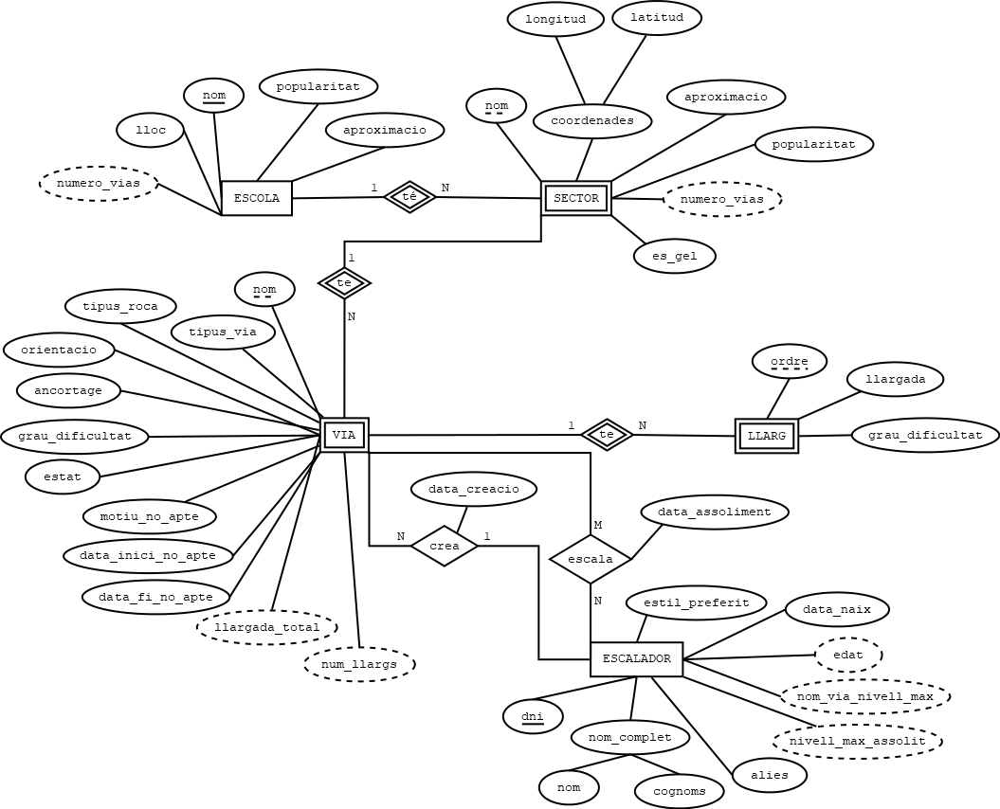
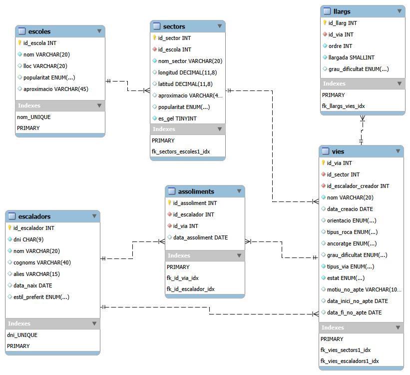
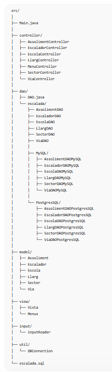
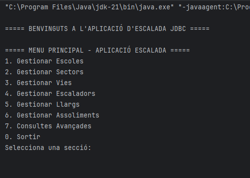

# # Dragon Ball API JSON JDBC

**Professor:** Xavier Martín  
**Autors:** Rasen Mediñà  
**Data:** 22 de Maig del 2026

## Descripció

Aplicació Java de persistència de dades desenvolupada per a l'assignatura **MS005 - Persistència de dades**.

Aquest projecte permet gestionar dades de l'univers Dragon Ball mitjançant:

* Connexió amb una API REST externa
* Lectura de fitxers JSON
* Persistència de dades amb JDBC
* Sincronització entre fonts externes i base de dades
* Gestió de dades des d'una interfície per terminal

L'aplicació treballa principalment amb informació de:

* Personatges
* Planetes

---------------------------------

## Diagrama Entitat-Relació

<p align="center">
  
</p>

---

## Esquema Relacional

<p align="center">
  
</p>

---

## Estructura del projecte

<p align="center">
  
</p>

---

## Exemple d'execució

<p align="center">
  
</p>

---------------------------------

## Tecnologies utilitzades

* Java
* JDBC
* MySQL
* JSON
* Gson
* Git & GitHub
* IntelliJ IDEA

## Funcionalitats principals

### 1. Llistar dades

Mostrar el contingut actual de la base de dades.

### 2. Mostrar dades externes

Visualitzar informació obtinguda des de:

* Endpoints API
* Fitxers JSON

### 3. Actualitzar registres

Actualitzar personatges existents a partir d'una font externa.

### 4. Sincronització de dades

* Còpia parcial
* Còpia completa

### 5. Control d'errors

Gestió de:

* Errors de connexió
* Errors d'estructura JSON
* Validació de dades
* Excepcions

## API utilitzada

Dragon Ball API:

* https://www.freepublicapis.com/dragon-ball-api
* https://web.dragonball-api.com/documentation

## Estructura inicial del projecte

```text
src/
│
├── api/
├── database/
├── json/
├── menu/
├── model/
├── service/
├── utils/
└── Main.java
```

## Taules principals

1. CHARACTER
Representa els personatges.

2. PLANET
Representa els planetes.

3. RACE
Races dels personatges.

4. TRANSFORMATION
Transformacions dels personatges.

5. SYNCHRONIZATION_LOG
Registre de sincronitzacions/importacions.
Aquesta taula queda molt bé acadèmicament perquè:

justifica persistència
justifica sincronització
justifica control d’errors

I és senzilla.

## Atributs

1. CHARACTER

Camp	Tipus	Restriccions
character_id	PK	autoincrement
name	varchar	NOT NULL UNIQUE
ki	int	CHECK ki >= 0
max_ki	int	CHECK max_ki >= ki
gender	varchar	nullable
description	text	nullable
image_url	varchar	nullable
planet_id	FK	nullable
race_id	FK	nullable
last_update	datetime	NOT NULL


2. PLANET

Camp	Tipus	Restriccions
planet_id	PK	autoincrement
name	varchar	NOT NULL UNIQUE
is_destroyed	boolean	default false
description	text	nullable
image_url	varchar	nullable

3. RACE

Camp	Tipus	Restriccions
race_id	PK	autoincrement
name	varchar	NOT NULL UNIQUE
description	text	nullable

4. TRANSFORMATION

Camp	Tipus	Restriccions
transformation_id	PK	autoincrement
name	varchar	NOT NULL
ki	int	CHECK ki >= 0
image_url	varchar	nullable
character_id	FK	NOT NULL


5. SYNCHRONIZATION_LOG

Camp	Tipus	Restriccions
log_id	PK	autoincrement
source_type	varchar	NOT NULL
operation_type	varchar	NOT NULL
sync_date	datetime	NOT NULL
status	varchar	NOT NULL
message	text	nullable

## Relacions

PLANET → CHARACTER
1 planeta → molts personatges

RACE → CHARACTER
1 raça → molts personatges

CHARACTER → TRANSFORMATION
1 personatge → moltes transformacions

SYNCHRONIZATION_LOG -> Independent.

## Restriccions

1. CHARACTER
el nom no pot repetir-se
el ki no pot ser negatiu
max_ki >= ki
un personatge pot existir sense planeta
un personatge pot existir sense transformacions

2. PLANET
el nom del planeta és únic
un planeta pot existir sense personatges

3. RACE
el nom de la raça és únic

4. TRANSFORMATION
una transformació sempre pertany a un personatge
el ki no pot ser negatiu

5. SYNCHRONIZATION_LOG
cada sincronització guarda:

data
tipus
resultat

# Avantatges del model

✅ És senzill

Només 5 taules.

✅ Té relacions reals

Sense inventar coses estranyes.

✅ És fàcil de passar a SQL
✅ És fàcil per JDBC
✅ És fàcil per JSON
✅ Té prou complexitat acadèmica

Però sense convertir-se en un infern.


